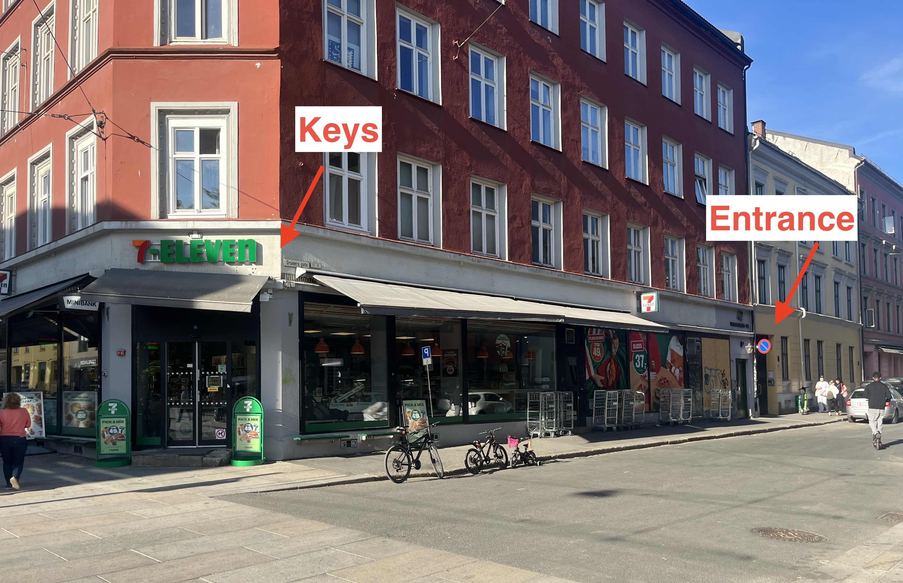

<h1>Welcome to our home 🏡🌼</h1>

🇳🇴 [Norwegian](https://percarlsen.github.io/gruners/no/) \| 🇺🇸 [English](https://percarlsen.github.io/gruners/en/)

Here is some important practical information about check-in, your stay, and check-out. Don't hesitate to contact us if you have any questions.

We hope you enjoy the apartment and have a great stay 😊

## Check-in

🔑 Keys can be picked up at the 7-Eleven at Olaf Ryes plass ([map](https://maps.app.goo.gl/qTAuWBMjggQdmRVP9)) using the pickup code you'll get on Airbnb.

🏡 The apartment is located at Grüners Gate 12B ([map](https://maps.app.goo.gl/3Ak5Gi62WnCwmsQ17)). The entrance is in the yellow building next to 7-Eleven. Enter the front door, walk all the way into the backyard and enter the door to the right. The apartment is on the 3rd floor on the right hand side with the label "Ida and Per" on the door.

## Practical info

ℹ️ This is an old building where any noise can be heard from neighboring apartments. <b>We kindly ask you to respect the quiet hours from 23:00 to 07:00.</b> The dishwasher and washing machine may not be used after 21:00.

ᯤ You will find the wifi password on the sideboard in the living room.

🧑🏼‍🍳 Feel free to use the kitchen and help yourself to the dry goods, coffee, and tea that you find in the cupboards. Please do not take the food that's left in the fridge; we have cleared space on a couple of shelves for you. You may use the dishwasher, but knives and wooden kitchen utensils must be washed by hand. The fuse may trip if you use the oven at the same time as both panel heaters in the living room are in use. If this happens, turn off one of the heaters and reset the fuse in the fuse box in the hallway (flip the switch up).

🗑️ Trash is sorted by packaging plastic (purple bags), food waste (green bags), general waste (black/regular bag), and cardboard, and is thrown in the bins in the backyard. You can dispose empty and clean glass and metal containers in the bins in the kitchen between the kitchen counter and the window, and we'll take care of it.

🔥 IMPORTANT: Due to fire hazard you must ensure that the panel heaters in the living are turned off before closing the curtains. There's a fire extinguisher in the entrance next to the sideboard should the accident occur.

👟 Please don't wear outdoors shoes indoors.

## Check-out

📌 Check-out is at 12:00. We ask you to kindly leave the apartment as you found it. Clean the kitchen counter and take the trash out. Turn off lights, close windows and the balcony door, lock the apartment door, and place the keys in the mailbox (Ida Giske and Per Carlsen, bottom right) on the first floor (you may have to remove the keys from the key ring for them to fit in the mailbox).
