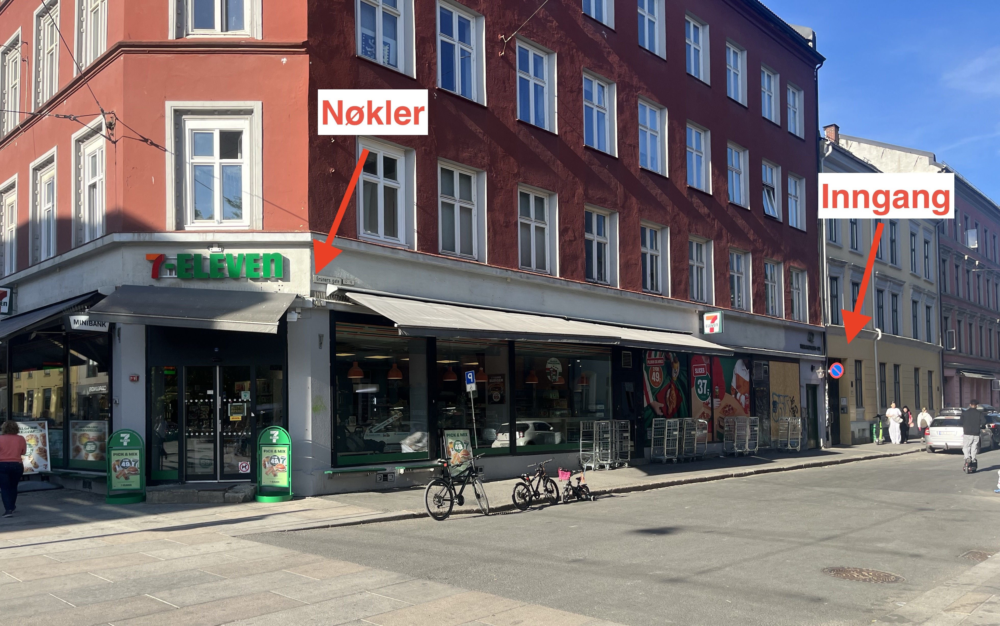
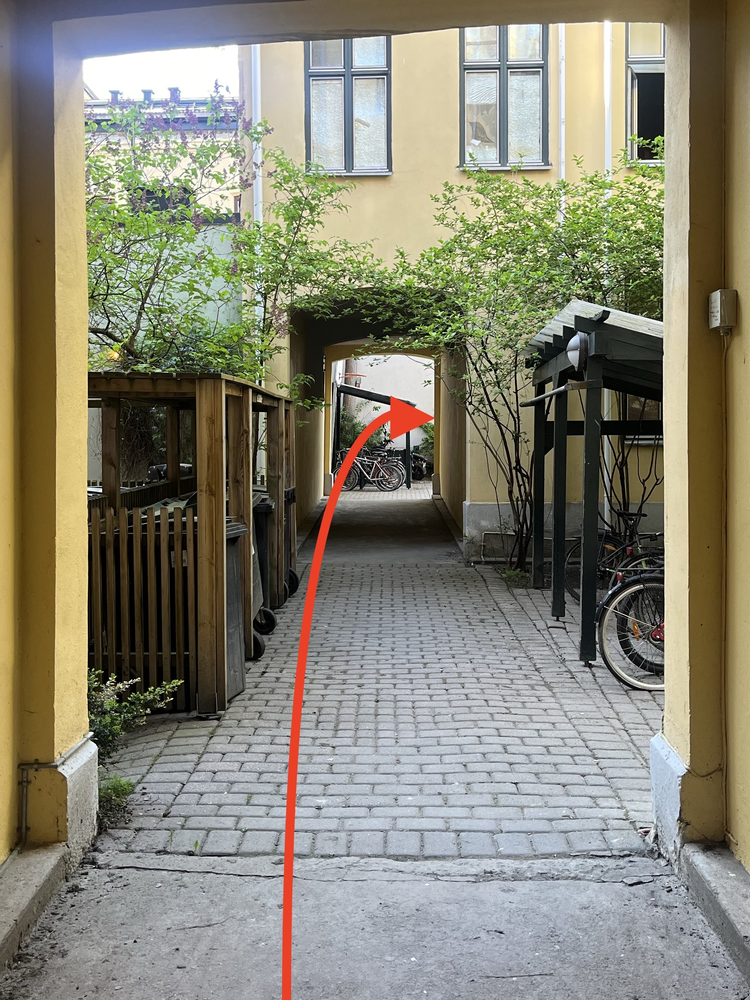

<h1>Velkommen til hjemmet vårt 🏡🌼</h1>

🇳🇴 [Norwegian](https://percarlsen.github.io/gruners/no/) | 🇺🇸 [English](https://percarlsen.github.io/gruners/en/)

Her kommer litt praktisk informasjon om innsjekk, oppholdet og utsjekk som det er viktig at dere leser gjennom. Ikke nøl med å kontakte oss hvis dere skulle ha noen spørsmål.

Vi håper dere trives i leiligheten og får et fint opphold 😊

## Innsjekk
🔑 Nøkler hentes på 7-eleven Olaf Ryes plass ([kart](https://maps.app.goo.gl/qTAuWBMjggQdmRVP9)) ved å oppgi hentekode som dere får tilsendt på Airbnb.

🏡 Leiligheten ligger i Grüners Gate 12B ([kart](https://maps.app.goo.gl/3Ak5Gi62WnCwmsQ17)). Gå helt inn i bakgården og inn døren til høyre. Leiligheten er i 3. etasje på høyre side, det står "Ida og Per" på døra.

## Praktisk info
ℹ️ Det bor flere barnefamilier i blokka og det er lytt mellom leilighetene. Det er derfor veldig viktig at stilletidene respekteres. <b>Det skal være stille fra 23:00 til 07:00.</b> Vaskemaskin og oppvaskmaskin må ikke brukes etter kl 21:00.

ᯤ Wifi-passord finner dere på skjenken i stua.

🧑🏼‍🍳 Dere må gjerne bruke kjøkkenet og benytte dere av tørrvarer, kaffe og te som dere finner i skapene. Vennligst la det som eventuelt står i kjøleskapet ligge, vi rydder plass i et par hyller til dere. Oppvaskmaskin kan brukes, men kniver og kjøkkenredskap i tre må vaskes for hånd. Det kan hende at sikringen går hvis dere bruker stekeovnen samtidig som begge panelovnene i stua står på. Om dette skjer, skru av en av ovnene og skru deretter på sikringen i sikringsskapet i gangen (flipp bryteren opp).

🗑️ Søppel sorteres etter emballasjeplast (lilla poser), matavfall (grønne poser), restavfall (svart/vanlig pose) og papp, og kastes i søppeldunker i bakgården. Glass og metall kastes i returpunkt i Grüners gate, ca 150m til venstre utenfor ytterdøra.

🧯 Brannslukningsapparat er på kjøkkenet mellom kjøkkenbenken og vinduet.

## Utsjekk
📌 Utsjekk er klokken 12:00. Forlat leiligheten slik dere fant den. Tørk av overflater og kast søppel. Skru av lys, lukk vinduer og balkongdør, lås døra til leiligheten og legg nøklene i postkassa (Ida Giske og Per Carlsen, nederste til høyre) i første etasje.
